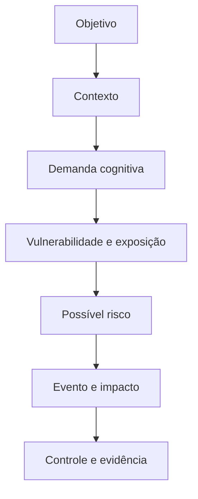
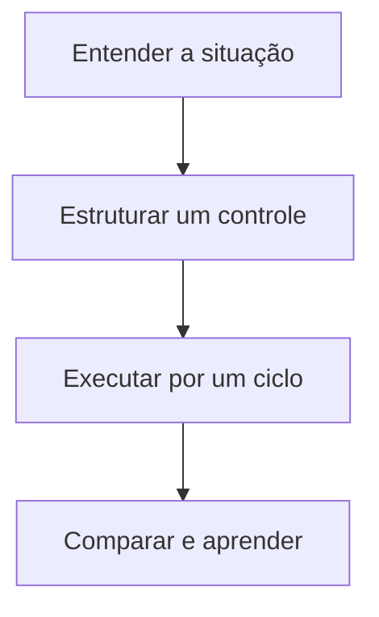

# O que é Risco Cognitivo?

> **Frase síntese:** Risco cognitivo nasce na relação entre objetivo, pessoa e sistema. — síntese a partir de ISO e EXECUTAR

**Resumo.** Uma tarefa parece simples: finalizar um relatório. Mas a pessoa precisa localizar arquivos, interpretar a prioridade, lembrar dependências, alternar sistemas e retomar decisões. Se essa arquitetura favorece erro, atraso ou abandono, há uma condição de risco para o objetivo — não uma falha moral da pessoa. Este artigo delimita o conceito, apresenta sua aplicação prática e preserva a regra central da série: fator, vulnerabilidade, exposição e risco são elementos diferentes.

# Parte A Quick Framework

## 1. Origem

**Termo.** O que é Risco Cognitivo?  
**Significado.** Conceito operacional da série Risco Cognitivo.  
**Etimologia.** Risco designa o efeito da incerteza sobre objetivos na linguagem da ISO 31000. Cognitivo deriva do latim cognoscere, conhecer. No EXECUTAR, a expressão não nomeia diagnóstico: organiza condições que podem comprometer uma execução quando demanda, vulnerabilidade e exposição se combinam.

## 2. Contexto

Uma tarefa parece simples: finalizar um relatório. Mas a pessoa precisa localizar arquivos, interpretar a prioridade, lembrar dependências, alternar sistemas e retomar decisões. Se essa arquitetura favorece erro, atraso ou abandono, há uma condição de risco para o objetivo — não uma falha moral da pessoa.

## 3. 5W2H

| Variável | Síntese |
|---|---|
| O que? | Investigar o conceito numa situação concreta. |
| Por quê? | Proteger o objetivo sem culpabilizar a pessoa. |
| Onde? | Pessoa, tarefa, ambiente, processo e tecnologia. |
| Quando? | Quando esforço, erro, espera ou retrabalho aumentarem. |
| Quem? | Executor e responsáveis pelo desenho do trabalho. |
| Como? | Observar, controlar, comparar e registrar evidência. |
| Quanto? | Um experimento pequeno por ciclo de execução. |

## 4. Referência padrão-ouro

ISO e EXECUTAR é a referência central deste recorte porque sustenta a definição de risco, carga mental ou desenho cognitivo usada pelo artigo. O framework EXECUTAR mantém explícitas as partes que são síntese própria.

**Autor curto:** ISO e EXECUTAR

## 5. Problema existente

**Definição.** Dificuldades de execução são atribuídas apenas à pessoa, enquanto tarefa, ambiente, processo e tecnologia permanecem fora da análise.  
**Identificação.** Aparece em sinais recorrentes de esforço, demora, erro ou reconstrução.  
**Explicação.** A demanda fica distribuída e sua origem operacional não é localizada.  
**Fechamento.** A pessoa absorve trabalho que o sistema poderia organizar.

## 6. Problema solucionado

**Definição.** A parte observável do problema recebe linguagem, fronteira e controle.  
**Identificação.** Definir objetivo, contexto, demanda, vulnerabilidade, exposição, evento e impacto antes de caracterizar ou controlar o risco.  
**Explicação.** O controle é testado em uma situação, sem prometer resultado universal.  
**Fechamento.** O aprendizado retorna ao processo.

## 7. Processo

1. **Entender:** registrar objetivo, contexto, sinais e impacto.
2. **Estruturar:** distinguir conceito, evidência, hipótese e controle.
3. **Executar:** testar uma mudança, comparar e registrar aprendizado.

## 8. Visão do sistema

## 9. Progresso esperado

Antes, a dificuldade parece isolada ou pessoal. Com o framework, a situação ganha objetivo, contexto, demanda e controle. Depois, torna-se possível testar uma mudança pequena e observar seu efeito sem produzir diagnóstico ou certeza indevida.

## 10. Aviso

Conteúdo educativo e operacional. Não oferece diagnóstico, escore clínico ou relação causal automática. A aplicação depende do objetivo, contexto e evidência observada.

## 11. Next 01-02-03

**Next 01 — Entender:** escolha uma situação real e descreva os sinais.  
**Next 02 — Estruturar:** localize a demanda e selecione um controle proporcional.  
**Next 03 — Executar:** teste por um ciclo e registre o que mudou.

## 12. Fontes e aprofundamento

- [ISO 31000:2018 — Risk management guidelines](https://www.iso.org/iso-31000-risk-management.html) — ISO, 2018.
- [ISO 10075-2:2024 — Design principles related to mental workload](https://www.iso.org/standard/76686.html) — ISO, 2024.
- [Making Content Usable for People with Cognitive and Learning Disabilities](https://www.w3.org/TR/coga-usable/) — W3C WAI, 2021.
- [Cognitive Offloading](https://pubmed.ncbi.nlm.nih.gov/27542527/) — Risko e Gilbert, 2016.

## 13. Infográfico 16:9

**Premissa 1 — Problema:** Dificuldades de execução são atribuídas apenas à pessoa, enquanto tarefa, ambiente, processo e tecnologia permanecem fora da análise.  
**Premissa 2 — Processo:** Entender a situação, estruturar controle e executar experimento.  
**Premissa 3 — Progresso:** A execução produz evidência para melhorar o sistema.  
**Conclusão:** Risco cognitivo nasce na relação entre objetivo, pessoa e sistema. — síntese a partir de ISO e EXECUTAR  
**Ilustração de topo:** Cena de trabalho mostrando a passagem de demanda invisível para controle observável.

# Parte B Artigo completo

## 01. O problema invisível entre cognição e risco

Nem toda dificuldade de execução é explicada por falta de esforço, conhecimento ou disciplina. Parte do problema pode estar no modo como informação, tarefas, interrupções, dependências e ferramentas foram organizadas. Quando o sistema exige localizar, lembrar, escolher, alternar e reconstruir contexto ao mesmo tempo, ele cria demandas adicionais antes da ação principal.

O risco aparece quando essas demandas podem comprometer um objetivo. A pergunta deixa de ser apenas “a pessoa consegue?” e passa a incluir “em quais condições ela precisa conseguir, com quais recursos e quais consequências se algo falhar?”. Essa mudança desloca a análise da culpa para a arquitetura da execução.

## 02. O que significa risco neste contexto

Na ISO 31000, risco é tratado em relação aos objetivos e à incerteza. Portanto, não existe risco em abstrato: é preciso saber o que se pretende alcançar, em qual contexto e que efeito indesejado pode atingir esse objetivo. Um arquivo difícil de encontrar pode ser pequena fricção numa tarefa sem prazo e condição crítica numa operação que depende de resposta imediata.

No framework EXECUTAR, “risco cognitivo” é uma categoria operacional. Ela ajuda a investigar como demandas de atenção, memória, interpretação, decisão e coordenação podem contribuir para eventos como erro, atraso, retrabalho, interrupção ou abandono. A integração é um modelo do projeto, não uma entidade clínica reconhecida.

## 03. O que significa cognitivo

Cognitivo se refere aos processos usados para perceber, manter informação, compreender, decidir, lembrar, alternar regras e dirigir uma ação a um objetivo. Isso não reduz o trabalho ao cérebro isolado. A cognição acontece numa relação com documentos, pessoas, sinais, ambientes, processos e tecnologias.

Uma checklist, por exemplo, pode manter etapas fora da memória interna. Um rótulo claro pode reduzir interpretação. Um ponto de retomada pode preservar o estado depois de uma interrupção. Esses recursos não “melhoram a pessoa”; eles redesenham a distribuição do trabalho cognitivo entre pessoa e sistema.

## 04. Definição operacional de risco cognitivo

Risco cognitivo é a possibilidade de que demandas cognitivas, combinadas com vulnerabilidades e exposição em um contexto específico, contribuam para eventos que prejudiquem um objetivo. A definição contém condições: possibilidade, combinação, contexto, evento e objetivo. Sem esses elementos, o termo perde precisão.

A cadeia usada no projeto é: Objetivo → Contexto → Demanda Cognitiva → Vulnerabilidade → Exposição → Risco Cognitivo → Evento → Impacto. Ela serve para ordenar a investigação. Não afirma que toda demanda leva inevitavelmente a um evento, nem oferece um escore clínico.

## 05. Risco cognitivo não é o mesmo que erro

Erro é um evento observável; risco é uma condição anterior de possibilidade. Um prazo perdido, uma informação enviada ao destinatário errado ou uma etapa omitida podem ser eventos. O risco estava na combinação que tornou esses eventos mais prováveis ou mais danosos: tarefa ambígua, dependência invisível, excesso de interrupções, ausência de conferência ou estado distribuído.

Separar risco de evento permite agir antes. Em vez de esperar que o erro se repita, a equipe pode observar sinais, testar um controle e acompanhar se o processo ficou mais confiável.

## 06. Risco cognitivo não é diagnóstico

O framework não classifica pessoas nem transforma neurodivergência, cansaço ou dificuldade de atenção em risco por si só. Uma característica pode se tornar relevante apenas quando interage com uma demanda, um contexto, uma exposição e um objetivo. A mesma pessoa pode encontrar barreira numa interface e funcionar bem em outra.

Por isso, a linguagem correta é condicional: “pode aumentar demanda”, “merece investigação” e “contribui em determinadas condições”. A linguagem incorreta é determinista: “essa pessoa é o risco” ou “esse fator sempre causa falha”.

## 07. Como o risco cognitivo se forma

A formação começa por um objetivo real. O contexto define restrições, recursos e consequências. A tarefa e o sistema impõem demandas: localizar, interpretar, lembrar, decidir, alternar, coordenar. Vulnerabilidades podem ser momentâneas, funcionais ou contextuais. Exposição descreve quanto e como a pessoa encontra essas condições.

Quando essa combinação supera os controles disponíveis, pode emergir uma condição de risco. Depois vêm eventos e impactos. O controle pode atuar em qualquer ponto: reduzir conteúdo, esclarecer tarefa, tornar dependência visível, limitar interrupção, externalizar memória ou adaptar o processo.

## 08. Exemplos no trabalho

Em um relatório, risco pode surgir quando dados estão em cinco fontes, o critério de pronto é incerto e a aprovação depende de alguém que não foi identificado. Em atendimento, pode surgir quando alertas equivalentes competem e informações essenciais ficam escondidas. Em estudo, pode surgir quando a plataforma não mostra sequência, prazo e próximo passo.

Esses exemplos não provam risco isoladamente. Eles indicam onde investigar: qual objetivo está ameaçado, qual demanda apareceu, com que frequência, por quanto tempo e com quais consequências.

## 09. Por que o contexto importa

A mesma condição muda de significado conforme a tarefa. Uma interrupção durante atividade exploratória pode ser tolerável; durante uma etapa crítica, pode exigir reconstrução custosa. Um grande volume de informação pode ser necessário para análise especializada e excessivo numa decisão rápida.

Contexto impede regras universais. O objetivo não é remover toda demanda cognitiva, mas distinguir demanda necessária de demanda evitável e assegurar controles proporcionais à criticidade da execução.

## 10. De onde vêm os fatores de risco

Os fatores podem surgir da pessoa e de seu estado momentâneo, da informação, da tarefa, do ambiente, da organização ou da tecnologia. No Knowledge Pack, vinte fatores foram distribuídos em cinco macrogrupos: Pessoa e Cognição; Informação e Interface; Tarefa e Fluxo; Ambiente e Contexto; Sistema e Arquitetura de Suporte.

Eles são pontos de inspeção, não vinte riscos autônomos. Quantidade de informação, troca de tarefas ou memória prospectiva só ganham significado quando ligados a objetivo, contexto e exposição.

## 11. Como o conceito pode ser gerido

Gerir começa por uma situação concreta. Registre o objetivo, os sinais e o impacto. Localize as demandas e escolha um controle pequeno: reorganizar informação, decompor a tarefa, expor dependências, criar gatilho, preservar ponto de retomada ou reduzir interrupções.

Depois, compare antes e depois com evidência simples: tempo de retomada, número de dúvidas, etapas omitidas, retrabalho ou conclusão da próxima ação. Controle sem observação vira opinião; observação sem controle vira inventário de problemas.

## 12. Próximo passo

Definir risco cognitivo cria a linguagem da série, mas ainda não mostra quais condições merecem inspeção. O próximo artigo apresenta os fatores de risco cognitivo: fontes de demanda que podem estar na pessoa, informação, tarefa, ambiente, organização e tecnologia.

A transição preserva a regra central: fator não é risco. Primeiro reconhecemos os fatores; depois avaliamos a exposição que lhes dá relevância numa situação real.

## Fechamento editorial

**Próximo conceito:** Fatores de Risco Cognitivo.  
**Artigo relacionado:** `ARTICLE-RC-002`.  
**CTA:** Escolha uma situação real, mapeie a demanda e teste um controle antes de concluir que o problema está na pessoa.

## Referências

- [ISO 31000:2018 — Risk management guidelines](https://www.iso.org/iso-31000-risk-management.html) — ISO, 2018.
- [ISO 10075-2:2024 — Design principles related to mental workload](https://www.iso.org/standard/76686.html) — ISO, 2024.
- [Making Content Usable for People with Cognitive and Learning Disabilities](https://www.w3.org/TR/coga-usable/) — W3C WAI, 2021.
- [Cognitive Offloading](https://pubmed.ncbi.nlm.nih.gov/27542527/) — Risko e Gilbert, 2016.
