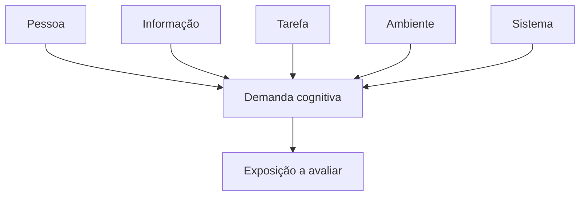
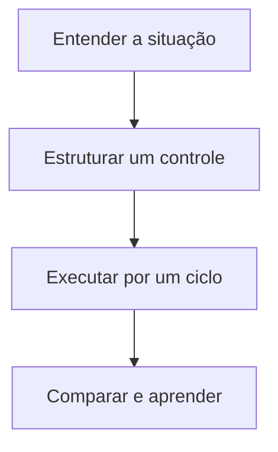

# Fatores de Risco Cognitivo: o que aumenta a probabilidade de falha?

> **Frase síntese:** Fatores mostram onde a execução começa a exigir esforço adicional. — síntese a partir de ISO, W3C e literatura experimental

**Resumo.** Uma pessoa tenta concluir uma entrega, mas enfrenta informação demais, tarefa vaga, dependências escondidas, interrupções, intenções futuras e sistemas desconectados. Cada ponto parece pequeno; juntos, eles mudam a arquitetura da execução. Este artigo delimita o conceito, apresenta sua aplicação prática e preserva a regra central da série: fator, vulnerabilidade, exposição e risco são elementos diferentes.

# Parte A Quick Framework

## 1. Origem

**Termo.** Fatores de Risco Cognitivo: o que aumenta a probabilidade de falha?  
**Significado.** Conceito operacional da série Risco Cognitivo.  
**Etimologia.** Fator vem do latim factor, aquilo que faz ou produz. Aqui, fator é uma condição que pode modificar a demanda ou a exposição. A palavra não autoriza tratá-lo como causa suficiente nem como risco já caracterizado.

## 2. Contexto

Uma pessoa tenta concluir uma entrega, mas enfrenta informação demais, tarefa vaga, dependências escondidas, interrupções, intenções futuras e sistemas desconectados. Cada ponto parece pequeno; juntos, eles mudam a arquitetura da execução.

## 3. 5W2H

| Variável | Síntese |
|---|---|
| O que? | Investigar o conceito numa situação concreta. |
| Por quê? | Proteger o objetivo sem culpabilizar a pessoa. |
| Onde? | Pessoa, tarefa, ambiente, processo e tecnologia. |
| Quando? | Quando esforço, erro, espera ou retrabalho aumentarem. |
| Quem? | Executor e responsáveis pelo desenho do trabalho. |
| Como? | Observar, controlar, comparar e registrar evidência. |
| Quanto? | Um experimento pequeno por ciclo de execução. |

## 4. Referência padrão-ouro

ISO, W3C e literatura experimental é a referência central deste recorte porque sustenta a definição de risco, carga mental ou desenho cognitivo usada pelo artigo. O framework EXECUTAR mantém explícitas as partes que são síntese própria.

**Autor curto:** ISO, W3C e literatura experimental

## 5. Problema existente

**Definição.** Os sinais aparecem como dificuldades isoladas, sem taxonomia que conecte pessoa, informação, tarefa, ambiente e sistema.  
**Identificação.** Aparece em sinais recorrentes de esforço, demora, erro ou reconstrução.  
**Explicação.** A demanda fica distribuída e sua origem operacional não é localizada.  
**Fechamento.** A pessoa absorve trabalho que o sistema poderia organizar.

## 6. Problema solucionado

**Definição.** A parte observável do problema recebe linguagem, fronteira e controle.  
**Identificação.** Usar vinte fatores como pontos de inspeção e priorizar os oito mais reconhecíveis na experiência cotidiana.  
**Explicação.** O controle é testado em uma situação, sem prometer resultado universal.  
**Fechamento.** O aprendizado retorna ao processo.

## 7. Processo

1. **Entender:** registrar objetivo, contexto, sinais e impacto.
2. **Estruturar:** distinguir conceito, evidência, hipótese e controle.
3. **Executar:** testar uma mudança, comparar e registrar aprendizado.

## 8. Visão do sistema

## 9. Progresso esperado

Antes, a dificuldade parece isolada ou pessoal. Com o framework, a situação ganha objetivo, contexto, demanda e controle. Depois, torna-se possível testar uma mudança pequena e observar seu efeito sem produzir diagnóstico ou certeza indevida.

## 10. Aviso

Conteúdo educativo e operacional. Não oferece diagnóstico, escore clínico ou relação causal automática. A aplicação depende do objetivo, contexto e evidência observada.

## 11. Next 01-02-03

**Next 01 — Entender:** escolha uma situação real e descreva os sinais.  
**Next 02 — Estruturar:** localize a demanda e selecione um controle proporcional.  
**Next 03 — Executar:** teste por um ciclo e registre o que mudou.

## 12. Fontes e aprofundamento

- [ISO 10075-2:2024 — Design principles related to mental workload](https://www.iso.org/standard/76686.html) — ISO, 2024.
- [Making Content Usable for People with Cognitive and Learning Disabilities](https://www.w3.org/TR/coga-usable/) — W3C WAI, 2021.
- [Avoid Too Much Content](https://www.w3.org/WAI/WCAG2/supplemental/patterns/o5p03-manageable-quantity/) — W3C WAI, 2021.
- [Make Short Critical Paths](https://www.w3.org/WAI/WCAG2/supplemental/patterns/o5p02-short-paths/) — W3C WAI, 2021.
- [Limit Interruptions](https://www.w3.org/WAI/WCAG2/supplemental/patterns/o5p01-minimal-interruptions/) — W3C WAI, 2021.
- [Costs of a predictable switch between simple cognitive tasks](https://doi.org/10.1037/0096-3445.124.2.207) — Rogers e Monsell, 1995.
- [Measuring visual clutter](https://doi.org/10.1167/7.2.17) — Rosenholtz, Li e Nakano, 2007.
- [The capacity of visual working memory for features and conjunctions](https://doi.org/10.1038/36846) — Luck e Vogel, 1997.
- [Cognitive Offloading](https://pubmed.ncbi.nlm.nih.gov/27542527/) — Risko e Gilbert, 2016.
- [Optimal use of reminders](https://pubmed.ncbi.nlm.nih.gov/31448938/) — Gilbert et al., 2019.

## 13. Infográfico 16:9

**Premissa 1 — Problema:** Os sinais aparecem como dificuldades isoladas, sem taxonomia que conecte pessoa, informação, tarefa, ambiente e sistema.  
**Premissa 2 — Processo:** Entender a situação, estruturar controle e executar experimento.  
**Premissa 3 — Progresso:** A execução produz evidência para melhorar o sistema.  
**Conclusão:** Fatores mostram onde a execução começa a exigir esforço adicional. — síntese a partir de ISO, W3C e literatura experimental  
**Ilustração de topo:** Cena de trabalho mostrando a passagem de demanda invisível para controle observável.

# Parte B Artigo completo

## 01. Por que risco exige fatores

Um risco não aparece sem condições que o tornem possível. Para investigar execução, precisamos observar onde surgem demandas de atenção, memória, interpretação, escolha, alternância e coordenação. Os fatores funcionam como pontos de entrada: mostram onde procurar antes que um evento seja reduzido a “desorganização” ou “falta de foco”.

O fator não encerra a análise. Ele apenas identifica uma condição potencialmente relevante. Quantidade de informação, por exemplo, pode ser necessária; o problema depende de como esse volume se relaciona com tarefa, tempo, estrutura e capacidade disponível.

## 02. O que é um fator de risco cognitivo

É uma condição da interação entre pessoa, tarefa, ambiente, processo, projeto ou tecnologia que pode aumentar uma demanda relevante para a execução. A definição evita dois extremos: culpar apenas a pessoa e culpar automaticamente qualquer ferramenta ou processo.

Um fator é observável por sinais. Informação demais exige filtragem; tarefa vaga exige interpretação; dependência oculta exige reconstrução; troca frequente exige reconfiguração; intenção futura exige lembrar na hora correta. Esses sinais permitem formular perguntas e testar controles.

## 03. Fator não é causa suficiente

Nenhum fator isolado prova que ocorrerá erro, atraso ou abandono. Pesquisas sobre troca de tarefas mostram custos mensuráveis em condições experimentais, mas isso não significa que toda alternância seja ruim. Orientações de acessibilidade recomendam limitar interrupções, mas algumas interrupções são necessárias.

A formulação correta é probabilística e contextual: o fator pode contribuir, sua presença merece investigação e seu efeito depende da exposição e dos controles. Essa cautela protege o conteúdo contra determinismo e promessas universais.

## 04. Fatores individuais

O macrogrupo Pessoa e Cognição inclui perfil funcional, memória prospectiva, fadiga decisória e competição pela atenção. Ele ajuda a observar diferenças e estados sem rotular a pessoa. Uma dificuldade pode aparecer porque a tarefa exige manter muitas intenções, tomar decisões repetidas ou resistir a sinais concorrentes.

O controle não precisa tentar modificar a pessoa. Pode mudar a forma de apresentação, oferecer alternativas, criar gatilhos, padronizar escolhas repetitivas ou reservar sinais fortes para eventos realmente acionáveis.

## 05. Fatores relacionados ao estado

Condições momentâneas alteram a capacidade disponível. Cansaço, pressão temporal, estresse contextual e acúmulo de decisões podem mudar a maneira como uma tarefa é executada. O Knowledge Pack não trata esses estados como diagnósticos; trata-os como parte do contexto que precisa ser registrado.

Uma boa análise evita inferir o estado de alguém. Em vez disso, pergunta o que ocorreu, em que momento, que demanda estava presente e qual apoio poderia reduzir dependência de memória, atenção ou decisão contínua.

## 06. Fatores ambientais

Ambiente físico, ruído, iluminação, interrupções, organização espacial, rotina e pistas de contexto podem apoiar ou competir com a execução. A ISO 10075-2 aborda desenho do sistema de trabalho, incluindo tarefa, equipamento, local e fatores sociais e organizacionais.

A análise ambiental não busca um cenário ideal universal. Busca compatibilidade: o ambiente permite perceber o que importa, acessar recursos, manter continuidade e recuperar o estado quando necessário?

## 07. Fatores organizacionais

Projetos e processos podem acrescentar carga quando usam controles desproporcionais, escondem dependências ou deixam papéis e critérios ambíguos. Tailoring, preparação, decomposição e cadeia de valor ajudam a ajustar o método ao tamanho, risco e estágio real da entrega.

Uma lista pode estar completa e ainda ocultar a ordem do trabalho. Se aprovar identidade desbloqueia finalizar página e publicar campanha depende da página, o sistema precisa mostrar essas relações. Caso contrário, alguém sustentará a sequência mentalmente.

## 08. Fatores tecnológicos

Tecnologia reduz trabalho quando absorve memória, coordenação e repetição. Ela aumenta trabalho quando distribui estado, duplica registro, gera notificações e exige alternância constante. Digitalização, portanto, não equivale automaticamente a utilidade cognitiva.

O W3C recomenda conteúdo administrável, caminhos críticos curtos e controle de interrupções. No cotidiano, isso significa priorizar a ação principal, revelar detalhes sob demanda, integrar estados e preservar um ponto claro de continuidade.

## 09. Interação entre fatores

Os fatores raramente aparecem sozinhos. Uma tarefa vaga pode exigir busca adicional; a busca pode atravessar vários aplicativos; as trocas podem interromper a memória do próximo passo; uma dependência oculta pode obrigar nova decisão. O efeito conjunto é maior do que a leitura isolada de cada item sugere.

Por isso, a unidade de análise deve ser a situação de execução. O mapa pergunta o que a pessoa tenta fazer, quais demandas surgem e onde o sistema pode absorver parte delas.

## 10. Acúmulo e combinação

No artigo master, oito fatores formam a linha principal: quantidade de informação, forma e visualização, clareza da tarefa, decomposição, dependências, troca de tarefas, memória prospectiva e ambiente digital. Eles representam uma progressão: encontrar, compreender, iniciar, sequenciar, manter, retomar e lembrar.

Os outros doze permanecem como aprofundamento. Essa seleção é editorial, não uma escala científica de importância. Em cada contexto, outro fator pode ser decisivo.

## 11. Por que presença não basta

Uma notificação existe, mas talvez não interrompa. Uma tarefa possui muitas etapas, mas pode estar bem estruturada. Uma pessoa usa lembretes, mas isso pode melhorar seu desempenho. Presença é diferente de exposição, e exposição é diferente de risco.

Para avançar, precisamos observar intensidade, frequência, duração, criticidade e contexto. Essas dimensões são uma estrutura operacional inicial do EXECUTAR, não um instrumento clínico validado.

## 12. Próximo passo

Depois de reconhecer fatores, a pergunta muda: quando um fator passa a importar para um objetivo real? O artigo seguinte apresenta exposição cognitiva como ponte entre condição e possível risco.

A análise deixa de contar fatores e começa a observar quanto, quantas vezes, por quanto tempo, em qual etapa e com quais consequências a pessoa encontra determinada demanda.

## Fechamento editorial

**Próximo conceito:** Exposição Cognitiva.  
**Artigo relacionado:** `ARTICLE-RC-003`.  
**CTA:** Escolha uma situação real, mapeie a demanda e teste um controle antes de concluir que o problema está na pessoa.

## Referências

- [ISO 10075-2:2024 — Design principles related to mental workload](https://www.iso.org/standard/76686.html) — ISO, 2024.
- [Making Content Usable for People with Cognitive and Learning Disabilities](https://www.w3.org/TR/coga-usable/) — W3C WAI, 2021.
- [Avoid Too Much Content](https://www.w3.org/WAI/WCAG2/supplemental/patterns/o5p03-manageable-quantity/) — W3C WAI, 2021.
- [Make Short Critical Paths](https://www.w3.org/WAI/WCAG2/supplemental/patterns/o5p02-short-paths/) — W3C WAI, 2021.
- [Limit Interruptions](https://www.w3.org/WAI/WCAG2/supplemental/patterns/o5p01-minimal-interruptions/) — W3C WAI, 2021.
- [Costs of a predictable switch between simple cognitive tasks](https://doi.org/10.1037/0096-3445.124.2.207) — Rogers e Monsell, 1995.
- [Measuring visual clutter](https://doi.org/10.1167/7.2.17) — Rosenholtz, Li e Nakano, 2007.
- [The capacity of visual working memory for features and conjunctions](https://doi.org/10.1038/36846) — Luck e Vogel, 1997.
- [Cognitive Offloading](https://pubmed.ncbi.nlm.nih.gov/27542527/) — Risko e Gilbert, 2016.
- [Optimal use of reminders](https://pubmed.ncbi.nlm.nih.gov/31448938/) — Gilbert et al., 2019.
