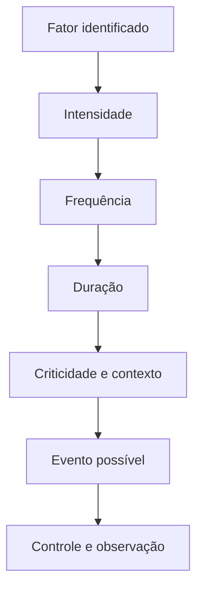
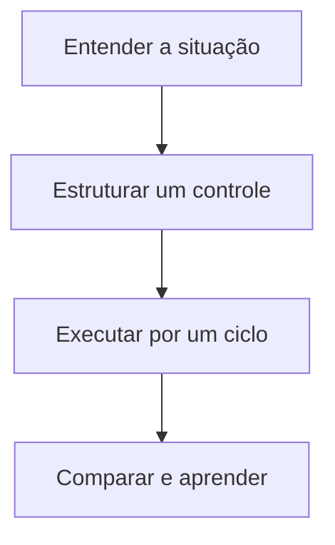

# Exposição Cognitiva: quando um fator de risco passa a importar?

> **Frase síntese:** Um fator importa quando encontra contexto, duração e consequência. — síntese a partir de ISO e síntese EXECUTAR

**Resumo.** Duas pessoas recebem a mesma notificação. Para uma, ela chega entre tarefas e não altera o trabalho. Para outra, interrompe uma etapa crítica, apaga o ponto de retomada e produz retrabalho. O fator é semelhante; a exposição não. Este artigo delimita o conceito, apresenta sua aplicação prática e preserva a regra central da série: fator, vulnerabilidade, exposição e risco são elementos diferentes.

# Parte A Quick Framework

## 1. Origem

**Termo.** Exposição Cognitiva: quando um fator de risco passa a importar?  
**Significado.** Conceito operacional da série Risco Cognitivo.  
**Etimologia.** Exposição vem do latim exponere, colocar para fora ou diante de algo. No framework, não significa contato físico: descreve como uma pessoa encontra uma demanda cognitiva ao executar um objetivo.

## 2. Contexto

Duas pessoas recebem a mesma notificação. Para uma, ela chega entre tarefas e não altera o trabalho. Para outra, interrompe uma etapa crítica, apaga o ponto de retomada e produz retrabalho. O fator é semelhante; a exposição não.

## 3. 5W2H

| Variável | Síntese |
|---|---|
| O que? | Investigar o conceito numa situação concreta. |
| Por quê? | Proteger o objetivo sem culpabilizar a pessoa. |
| Onde? | Pessoa, tarefa, ambiente, processo e tecnologia. |
| Quando? | Quando esforço, erro, espera ou retrabalho aumentarem. |
| Quem? | Executor e responsáveis pelo desenho do trabalho. |
| Como? | Observar, controlar, comparar e registrar evidência. |
| Quanto? | Um experimento pequeno por ciclo de execução. |

## 4. Referência padrão-ouro

ISO e síntese EXECUTAR é a referência central deste recorte porque sustenta a definição de risco, carga mental ou desenho cognitivo usada pelo artigo. O framework EXECUTAR mantém explícitas as partes que são síntese própria.

**Autor curto:** ISO e síntese EXECUTAR

## 5. Problema existente

**Definição.** Contar fatores sem observar intensidade, frequência, duração, criticidade e contexto produz conclusões imprecisas.  
**Identificação.** Aparece em sinais recorrentes de esforço, demora, erro ou reconstrução.  
**Explicação.** A demanda fica distribuída e sua origem operacional não é localizada.  
**Fechamento.** A pessoa absorve trabalho que o sistema poderia organizar.

## 6. Problema solucionado

**Definição.** A parte observável do problema recebe linguagem, fronteira e controle.  
**Identificação.** Registrar a exposição numa situação concreta e ligar sinais a eventos, impactos e controles testáveis.  
**Explicação.** O controle é testado em uma situação, sem prometer resultado universal.  
**Fechamento.** O aprendizado retorna ao processo.

## 7. Processo

1. **Entender:** registrar objetivo, contexto, sinais e impacto.
2. **Estruturar:** distinguir conceito, evidência, hipótese e controle.
3. **Executar:** testar uma mudança, comparar e registrar aprendizado.

## 8. Visão do sistema

## 9. Progresso esperado

Antes, a dificuldade parece isolada ou pessoal. Com o framework, a situação ganha objetivo, contexto, demanda e controle. Depois, torna-se possível testar uma mudança pequena e observar seu efeito sem produzir diagnóstico ou certeza indevida.

## 10. Aviso

Conteúdo educativo e operacional. Não oferece diagnóstico, escore clínico ou relação causal automática. A aplicação depende do objetivo, contexto e evidência observada.

## 11. Next 01-02-03

**Next 01 — Entender:** escolha uma situação real e descreva os sinais.  
**Next 02 — Estruturar:** localize a demanda e selecione um controle proporcional.  
**Next 03 — Executar:** teste por um ciclo e registre o que mudou.

## 12. Fontes e aprofundamento

- [ISO 31000:2018 — Risk management guidelines](https://www.iso.org/iso-31000-risk-management.html) — ISO, 2018.
- [ISO 10075-2:2024 — Design principles related to mental workload](https://www.iso.org/standard/76686.html) — ISO, 2024.
- [Making Content Usable for People with Cognitive and Learning Disabilities](https://www.w3.org/TR/coga-usable/) — W3C WAI, 2021.
- [Limit Interruptions](https://www.w3.org/WAI/WCAG2/supplemental/patterns/o5p01-minimal-interruptions/) — W3C WAI, 2021.
- [Costs of a predictable switch between simple cognitive tasks](https://doi.org/10.1037/0096-3445.124.2.207) — Rogers e Monsell, 1995.
- [Cognitive Offloading](https://pubmed.ncbi.nlm.nih.gov/27542527/) — Risko e Gilbert, 2016.
- [Optimal use of reminders](https://pubmed.ncbi.nlm.nih.gov/31448938/) — Gilbert et al., 2019.

## 13. Infográfico 16:9

**Premissa 1 — Problema:** Contar fatores sem observar intensidade, frequência, duração, criticidade e contexto produz conclusões imprecisas.  
**Premissa 2 — Processo:** Entender a situação, estruturar controle e executar experimento.  
**Premissa 3 — Progresso:** A execução produz evidência para melhorar o sistema.  
**Conclusão:** Um fator importa quando encontra contexto, duração e consequência. — síntese a partir de ISO e síntese EXECUTAR  
**Ilustração de topo:** Cena de trabalho mostrando a passagem de demanda invisível para controle observável.

# Parte B Artigo completo

## 01. Ter um fator não significa estar igualmente em risco

A presença de um fator apenas abre uma investigação. Duas tarefas podem conter muitas informações, mas uma oferece hierarquia e tempo; a outra mistura alertas, decisões e ações numa etapa urgente. Duas pessoas podem receber a mesma interrupção, mas em momentos e consequências diferentes.

O que muda é a exposição: como a demanda alcança a execução. Sem essa camada, a análise transforma condições comuns em rótulos absolutos e perde a capacidade de priorizar controles.

## 02. O que é exposição cognitiva

Exposição cognitiva é a relação observável entre uma pessoa, uma demanda e uma situação de execução durante certo período. Ela descreve quanto, com que frequência, por quanto tempo e em que condição a demanda precisa ser enfrentada.

A definição pertence ao framework operacional do projeto. Não é diagnóstico nem escala clínica. Sua função é impedir o salto direto de “há um fator” para “há risco”, tornando explícitos contexto, consequência e controle.

## 03. Fator e exposição

Fator é a condição; exposição é o modo como ela participa da situação. Notificações são um fator. Receber vinte alertas durante uma etapa que exige manter regras temporárias é exposição. Tarefa vaga é um fator. Precisar reinterpretá-la em cada retomada, sob prazo curto, é exposição.

Essa distinção melhora a intervenção. Eliminar toda notificação pode ser inviável; classificar alertas, silenciar os não acionáveis e preservar um ponto de retomada atua na exposição relevante.

## 04. Intensidade

Intensidade descreve o volume ou a força da demanda num episódio. Pode aparecer como quantidade de elementos simultâneos, número de decisões encadeadas, complexidade da reconstrução ou pressão para responder. Não existe uma unidade universal aplicável a todos os fatores.

Registre intensidade com indicadores do próprio trabalho: quantas fontes precisam ser consultadas, quantas regras ficam ativas, quantos passos são reconstruídos ou quantas decisões cabem antes da ação principal.

## 05. Frequência

Frequência descreve quantas vezes a demanda reaparece numa janela relevante. Uma interrupção isolada pode ter pouco efeito; dezenas de trocas por hora podem transformar continuidade em exceção. Uma dependência obscura pode ocorrer uma vez ou repetir-se em cada etapa.

A medida deve servir à decisão. Conte por sessão, turno, atividade ou ciclo — a janela que permita comparar antes e depois de um controle.

## 06. Duração

Duração descreve por quanto tempo a pessoa permanece sob a demanda ou quanto tempo leva para recuperar a execução. Ela não deve ser confundida com estimativas universais de “tempo perdido”, pois o custo varia por tarefa, pista de retomada e contexto.

É possível observar duração localmente: tempo entre interrupção e próxima ação útil, período aguardando dependência, minutos gastos procurando informação ou extensão da etapa em que várias intenções precisam permanecer ativas.

## 07. Criticidade

Criticidade liga a exposição às consequências. Uma omissão numa lista de leitura e uma omissão num procedimento de segurança não têm o mesmo impacto. O mesmo fator pode exigir controles diferentes quando prazo, reversibilidade, qualidade, custo ou proteção de pessoas mudam.

Criticidade não autoriza alarmismo. Ela exige definir o que pode acontecer, quem ou o que é afetado, se o evento pode ser corrigido e qual nível de controle é proporcional.

## 08. Contexto da tarefa

O contexto reúne objetivo, estágio, ambiente, recursos, dependências, experiência e condições momentâneas. Ele explica por que uma exposição muda ao longo da mesma atividade. No início, explorar opções pode ser útil; perto da entrega, novas opções podem aumentar retrabalho.

Registrar contexto evita comparar situações incompatíveis. Também revela controles mais específicos: uma pista no ponto de decisão, uma verificação antes da etapa crítica ou um modo sem interrupções durante certo intervalo.

## 09. Interação entre fatores

Exposições se combinam. Informação demais pode exigir busca; interface sem hierarquia prolonga a busca; troca de aplicativos interrompe o raciocínio; tarefa ambígua exige nova decisão; memória prospectiva mantém uma intenção competindo ao fundo.

Não some fatores como se fossem pontos equivalentes. Descreva a cadeia observada: qual condição iniciou a demanda, o que a prolongou, que controle faltou e que evento apareceu ou quase apareceu.

## 10. Exposição aguda e crônica

No framework, exposição aguda é concentrada num episódio curto; exposição crônica é recorrente ou persistente ao longo de ciclos. Os termos são descritivos e não clínicos. Uma pane que força reconstrução intensa pode ser aguda; alternar entre cinco sistemas todos os dias pode ser crônico.

A distinção orienta controles. Episódios concentrados podem exigir proteção no momento crítico. Exposições recorrentes pedem mudança de processo, integração ou redesign do ambiente.

## 11. Como começar a observar exposição

Escolha uma atividade real e registre: objetivo; fator percebido; intensidade; frequência; duração; criticidade; contexto; evento observado; impacto; controle atual. Depois selecione apenas uma mudança pequena e reversível.

Exemplo: durante revisão de relatório, mensagens interrompem quatro vezes por sessão; cada retorno exige reler o último bloco; há prazo no mesmo dia. Controle: silenciar alertas não críticos por vinte minutos e registrar o próximo passo antes da pausa. Evidência: número de retomadas e releituras.

## 12. De exposição a evento

Exposição ainda não é evento. Ela descreve uma condição que merece atenção. Evento é o que efetivamente ocorre: omissão, erro, atraso, retrabalho, interrupção ou abandono. Impacto é o efeito sobre o objetivo.

O próximo nível do sistema deve ligar exposição a evento e controle sem converter correlação em causalidade automática. O ciclo termina com evidência e aprendizado: o controle mudou o sinal? O evento diminuiu? Surgiu uma nova demanda? A resposta atualiza o processo.

## Fechamento editorial

**Próximo conceito:** Evento, impacto e controle.  
**Artigo relacionado:** `ARTICLE-RC-001`.  
**CTA:** Escolha uma situação real, mapeie a demanda e teste um controle antes de concluir que o problema está na pessoa.

## Referências

- [ISO 31000:2018 — Risk management guidelines](https://www.iso.org/iso-31000-risk-management.html) — ISO, 2018.
- [ISO 10075-2:2024 — Design principles related to mental workload](https://www.iso.org/standard/76686.html) — ISO, 2024.
- [Making Content Usable for People with Cognitive and Learning Disabilities](https://www.w3.org/TR/coga-usable/) — W3C WAI, 2021.
- [Limit Interruptions](https://www.w3.org/WAI/WCAG2/supplemental/patterns/o5p01-minimal-interruptions/) — W3C WAI, 2021.
- [Costs of a predictable switch between simple cognitive tasks](https://doi.org/10.1037/0096-3445.124.2.207) — Rogers e Monsell, 1995.
- [Cognitive Offloading](https://pubmed.ncbi.nlm.nih.gov/27542527/) — Risko e Gilbert, 2016.
- [Optimal use of reminders](https://pubmed.ncbi.nlm.nih.gov/31448938/) — Gilbert et al., 2019.
